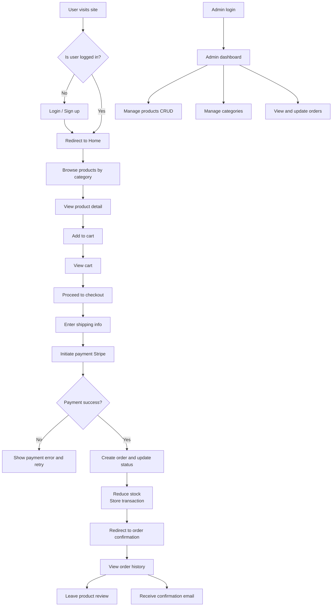

```mermaid
flowchart TD
    A[User visits site] --> B{Is user logged in?}
    B -- No --> C[Login / Sign up]
    C --> D[Redirect to Home]
    B -- Yes --> D[Redirect to Home]

    D --> E[Browse products by category]
    E --> F[View product detail]
    F --> G[Add to cart]
    G --> H[View cart]
    H --> I[Proceed to checkout]
    I --> J[Enter shipping info]
    J --> K[Initiate payment Stripe]

    K --> L{Payment success?}
    L -- No --> M[Show payment error and retry]
    L -- Yes --> N[Create order and update status]
    N --> O[Reduce stock<br/>Store transaction]
    O --> P[Redirect to order confirmation]
    P --> Q[View order history]

    %% Admin Flow
    R[Admin login] --> S[Admin dashboard]
    S --> T[Manage products CRUD]
    S --> U[Manage categories]
    S --> V[View and update orders]

    %% Optional Future Enhancements
    Q --> W[Leave product review]
    Q --> X[Receive confirmation email]

```
